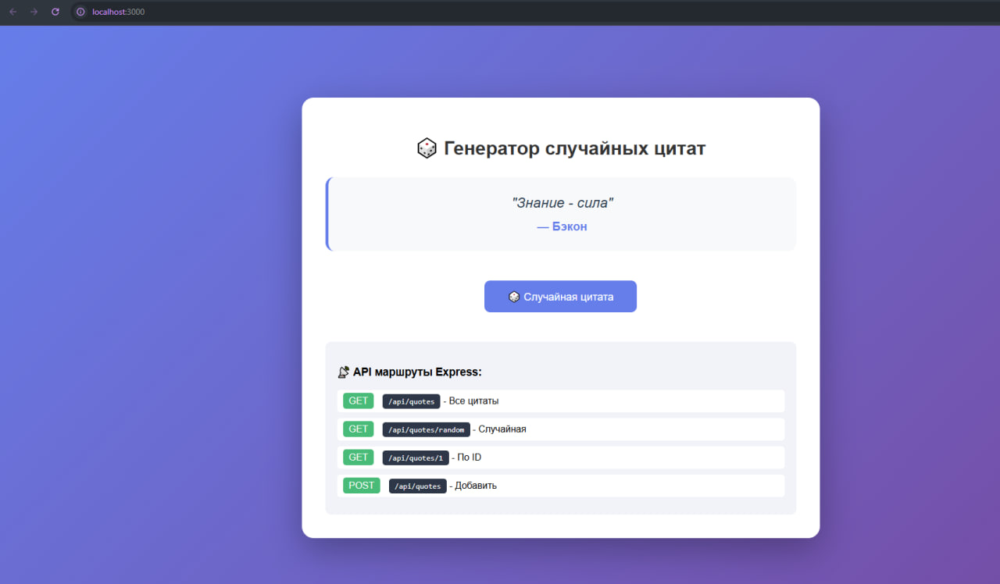
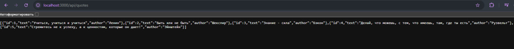

#  Генератор случайных цитат

Express-приложение с REST API для работы с цитатами.

##  Быстрый старт

```bash
npm install
npm start
Открыть в браузере: http://localhost:3000

 API
Метод	Маршрут	Описание
GET	/api/quotes	Все цитаты
GET	/api/quotes/random	Случайная цитата
GET	/api/quotes/:id	Цитата по ID
POST	/api/quotes	Добавить цитату

 Скриншоты


API в работе


Технологии
Node.js + Express.js

REST API

JavaScript

